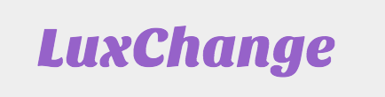
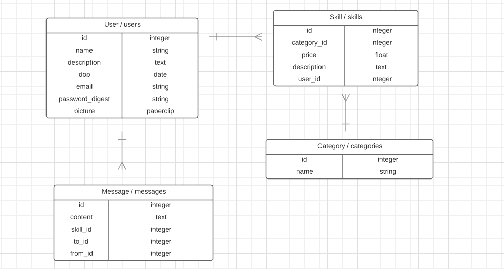

##LuxChange 

###Description  

Welcome to LuxChange! Connect with others to exchange your talents. 

Post your talent, list a value, and swap it for a service of similar worth. 

This website is specially dedicated to women. Since we all want to improve our lifestyle without investing a big amount of money in luxuries, such as a facial or a massage even maybe a simple trade of cooking recipes for a healthy lifestyle, the simple things that can make your life easier.

It's a community where you can express freely about your hobbies, interests, knowledgment and necessities, also where you will find other women like you with the same interests and/or necessities, showing your skills and getting something in return!
 

###Technologies Used  
<li> HTML5</li>
<li> Bootstrap </li>
<li> SCSS</li>
<li> SASS</li>
<li> Ruby on Rails</li>
<li> Active Record </li>
<li> Heroku</li>
<li>PostgreSQL</li>

###Wireframes 

###ERD 

###Installation Instructions  

	- Step 1: Clone the repository.

	- Step 2: Open app directory.
	
	- Step 3: Install gems.
	
	- Step 4: Open Rails server.
	
	- Step 5: In browser open: localhost:3000

###Approach Taken  
During this project, I used gems like "cocoon", "bootstrap-sass", "twitter-bootstrap-rails".  
- Cocoon: Used it to add a link to add a piece of form, to add more Skills in case the user needs it.  
- Bootstrap-sass: Used it to add style with SASS.  
- Twitter-bootstrap-rails: Used it to add the slide of images in the home page.

I also got to understand more about nested routes and permissions of each user.

Styles and links between views to give the user a fluid site navigation.

AWS is used to upload images for the profile picture of the user.

###Unsolved Problems  
Add Navbar for different aspects of the company, not enough time to do it.

###Links  

<li>
[Trello User Story](https://trello.com/b/GCpI5t4q/project-2)
</li>

By: Viviana Rishe
