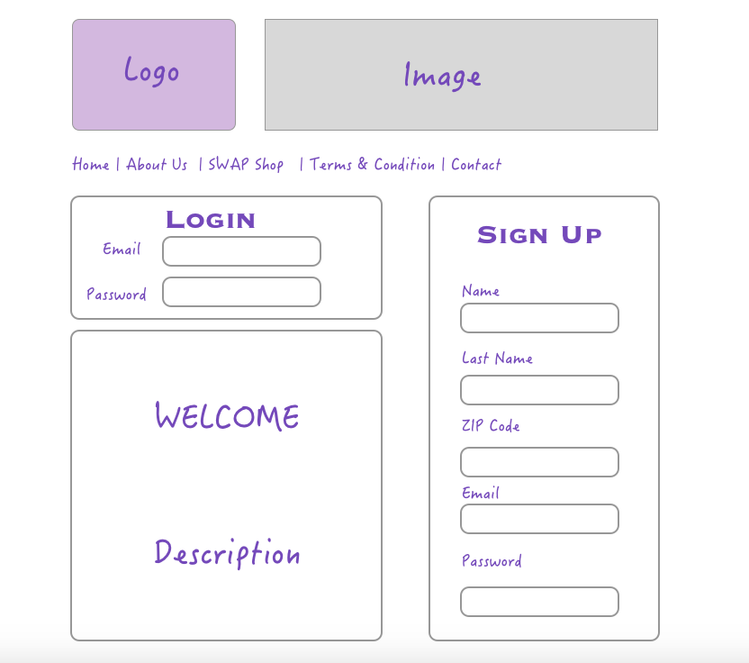
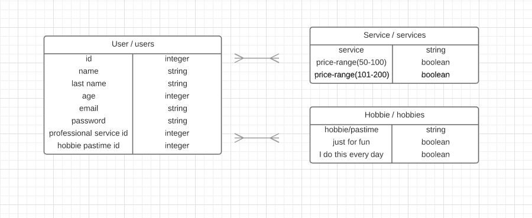

##LuxChange 

###Description  

Welcome to LuxChange! Connect with others to exchange your talents. 

Post your talent, list a value, and swap it for a service of similar worth. 

This website is specially dedicated to women. Since we all want to improve our lifestyle without investing a big amount of money in luxuries, such as a facial or a massage even maybe a simple trade of cooking recipes for a healthy lifestyle, the simple things that can make your life easier.

It's a community where you can express freely about your hobbies, interests, knowledgment and necessities, also where you will find other women like you with the same interests and/or necessities, showing your skills and getting something in return!
 

###Technologies Used  
<li> HTML5</li>
<li> CSS3</li>
<li> JavaScript</li>
<li> Ruby on Rails</li>
<li> Active Record </li>
<li> Heroku</li>

###Wireframes 

###ERD 

###Installation Instructions  

- Download Instructions:

	- Step 1: Clone the repository.

	- Step 2: Open index.html in your browser.

###Approach Taken  

###Unsolved Problems  

###Links  

<li>
[Trello User Story](https://trello.com/b/GCpI5t4q/project-2)
</li>

By: Viviana Rishe
